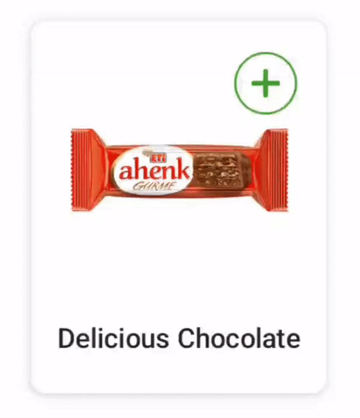

 

## QuantityPicker
QuantityPicker is compose component to add/remove anything

## Installation
- To implement **QuantityPicker** to your Android project via Gradle, you need to add JitPack repository to your root/project level build.gradle.
```gradle
allprojects {  
 repositories { ... maven { url 'https://jitpack.io' } }}  
```
- After adding JitPack repository, you can add **QuantityPicker** dependency to your app/module level build.gradle.
```gradle
dependencies {
 implementation 'com.github.selimtoksal:QuantityPicker:0.0.1'
 }
```

## Usage
You can add **QuantityPicker** wherever you want with your modifier

quantityPickerShape attribute defines background of your **QuantityPicker** and border

| Attribute | Type | Description |
| --------- | ---- | ----------- |
| modifier | Modifier | Compose modifier for QuantityPicker |
| quantityTextModifier | Modifier | Compose modifier for quantity text. if you need background or custom modifier etc. |
| textStyle | TextStyle | Text style for quantity text |
| addIconResId | Int | Drawable for add button |
| subtractIconResId | Int | Drawable for subtract button |
| removeIconResId | Int | Drawable for remove button. Visible if it is null and current quantity is 1 |
| quantityPickerShape | QuantityPickerShape | Background of all view also defines border if it is not null |
| quantityData | QuantityData | Quantity values. It has min,max,current and postfix | 
| showLoading | Boolean | Loading state |
| addIconContentDescription | String | contentDescription for add button |
| subtractIconContentDescription | String | contentDescription for subtract button |
| progressColor | Color | Color for loading progress indicator |
| onAddClick | (() -> Unit) | Listener for add button clicks |
| onSubtractClick | (() -> Unit) | Listener for subtract clicks |

## Implementation

If you don't need any customization

```kotlin
QuantityPicker(
    quantityData = quantityData,
    addIconResId = R.drawable.ic_plus,
    subtractIconResId = R.drawable.ic_minus,
    removeIconResId = R.drawable.ic_remove,
    showLoading = isLoading,
    onAddClick = { },
    onSubtractClick = { }
)
```

If you need background or custom modifier for quantity text and all view

```kotlin
QuantityPicker(
    textStyle = Typography.body2,
    quantityData = quantityData,
    addIconResId = R.drawable.ic_plus,
    subtractIconResId = R.drawable.ic_minus,
    quantityPickerShape = QuantityPickerShape(
        shape = RoundedCornerShape(50),
        borderColor = MyQuantityPickerPrimaryColor,
        borderWidth = 1.dp
    ),
    removeIconResId = R.drawable.ic_remove,
    quantityTextModifier = Modifier
        .background(
            color = MyQuantityPickerPrimaryColor,
            shape = CircleShape
        )
        .padding(vertical = 4.dp, horizontal = 8.dp),
    showLoading = isLoading,
    progressColor = MyQuantityPickerPrimaryColor,
    onAddClick = { },
    onSubtractClick = { }
)
```

## Contribution
Feel free to contribute

## Inspired
This library is inspired by [QuantityPickerView in Trendyol android-ui-components](https://github.com/Trendyol/android-ui-components/tree/master/libraries/quantity-picker-view)

